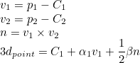

# ROBOTICS VISION 
## [Vicente Gilabert Maño](https://www.linkedin.com/in/vgilabert/)
### Master degree in Computer Vision (URJC)

---

## Exercise 2 - 3D Reconstruction


### 1. Introduction
En este trabajo se va a realizar una reconstrucción 3D utilizando un robot (kobuki) con visión estereoscópica. La reconstrucción 3D es el proceso de determinar el perfil 3D de un objeto, así como conocer la coordenada 3D de cualquier punto del perfil. 

En nuestro caso la reconstrucción se va a realizar basada en software.  Este enfoque se basa en la capacidad de cálculo del ordenador para determinar las propiedades 3D del objeto mediante dos imágenes de la escena obtenidas cámaras en diferente posición. Utilizaremos la geometría epipolar con las propiedades y restricciones que nos aporta, poder realizar la triangulación de las dos imágenes en un punto y obtener la profundidad del punto. 

A continuación, se muestra una imagen de la escena a reconstruir con los diversos objetos en ella: 

<p align="center">
	
</p>

La siguiente imagen muestra la vista de cada camara del robot, que es la informacion que tenemos para realizar la reconstruccion 3D.

<p align="center">
	
</p>

Tenemos que revisar algunas de la funcion y metodos que nos proporciona la plataforma JdeRobotics para la implementacion de la solucion. A continuacion se exponen los que se van a utilizar:

* Obtención de imagen de la cámara indicada:
  ```python
  HAL.getImage('left')
  ```

* Mostrar imagen y mostrar multiples imagenes:
  ```python
  GUI.showImage(img)
  GUI.showImages(edgesLH, edgesRH, True)
  ```

* Cambio de coordenadas de la imagen a coordenadas de la cámara:
  ```python
  HAL.graficToOptical('left',point2d_homogeneous)
  ```

* Cambio de coordenadas de la cámara a coordenadas de la imagen:
  ```python
  HAL.opticalToGrafic('left',point3d_homogeneous)
  ```

* Calcular la proyección de un punto 3d a un plano imagen:
  ```python
  HAL.project('left', point3d)
  ```

* Calcula la linea de retroproyección con un punto 2D (imagen):
  ```python
  HAL.backproject('left',point2d)
  ```

* Convertir un punto 3D del eje de coordenadas a un punto 3D de la escena:
  ```python
  HAL.project3DScene(point3d)
  ```


### 2. Preprocesado

Para poder realizar la reconstruccion 3D, el primer paso seria obtener puntos característicos para realacionarlos en las dos imágenes.
En algunos casos se pueden utilizar caracteristicas extraidas mediante descriptores como SIFT o ORB. 


En nuestro caso se van a utilizar los bordes (frecuencias altas) de las imágenes para conseguir los puntos caracteriscos de ambas imagenes y calcular la relación entre ellas. Para ello usaremos un filtrado de bordes Canny que nos deja la imagen filtrada con los bordes bastante finos. Se utiliza un filtrado bilateral para homogeneizar la imagen y evitar el posible ruido.

<p align="center">
	
</p>

> **_NOTA:_** *La función desarrollada para obtener el resultado anterior es: get_edges(img, sigma=0.33)*


### 3. Selección de los puntos 2D

Una vez tenemos las imágenes de bordes que hemos visto en el punto anterior, se obtienen las coordenadas de los píxeles diferentes a un valor 0 por lo que se devuelve es la posicion (Y,X) de cada punto caracteristico.

Utilizando el filtrado bilateral que hemos comentado, conseguimos reducir la gran cantidad de puntos caracteriticos. Debido a que cada vez que se ha probado obtenemos alrededor de 12000-18000 puntos característicos para procesar y obtener el punto correcpondiente en 3D.  

Para evitar procesar la gran cantidad de puntos, se implementa la opción de selección aleatoria de puntos característicos usando la variable N que aplica un filtrado para quedarnos con un porcentage de puntos característicos. En este paso se puede configurar el parámetro N (valores >0 y hasta 1) que es un porcentaje para filtrar todos los puntos, donde un valor de 1 significa que no haya filtrado y se seleccionen todos los puntos y un valor de 0.5 significa que **aleatoriamente** nos quedamos con la mitad de los puntos.

El resultado sera un array de dimensiones (total_points, 2).

> **_NOTA:_** *La función desarrollada para obtener el resultado anterior es: get_pixels_to_match(img, N=1)*


### 4. Cálculo de la epipolar.

Utilizando los puntos característicos obtenidos en el apartado anterior, que son puntos 2D en coordenadas imagen, se va a realizar el cálculo de la linea epipolar para tratar de encontrar el pixel homólogo en la imagen derecha.

Teniendo un pixel en una imagen no se puede llegar a obtener un punto en el espacio 3D, pero retroproyectando desde el centro de la cámara (O1) al pixel (p) en coordenadas de cámara conseguimos una recta que ya  nos puede ser util para seguir con nuestro problema.

Con la recta obtenida (O1, p), podemos proyectar la recta en la cámara derecha obteniendo la linea epipolar (e', p').

La linea epipolar nos indica la posición en la que debe estar el pixel de la imagen izquierda en la imagen derecha. 
No nos indica un punto sino una recta, que consigue hacer un gran restricción del problema ya que debemos buscar la coincidencia en esta linea.

<p align="center">
	
</p>

> **_NOTA:_** *La función desarrollada para obtener el resultado anterior es: get_epipolar(cam, ray, imgSize, ksize=9)*


### 5. Encontrar el homólogo.

Con la recta epipolar obtenida en el apartado anterior, se va a realizar un *template matching* de una localidad del pixel de la image izquierda en cada pixel comprendido en la linea epipolar obtenida.

Utilizando una funcion de OpenCV para realizar el *matching* (cv2.matchTemplate) con la configuración de correlación cruzada media desplazada (cv2.TM_CCOEFF_NORMED), se recorre la linea epipolar obtenida para encontrar el mejor *match* para la localidad de la imagen de la izquierda.

<p align="center">
	
</p>

Para optimizar el procesado y no buscar en toda la imagen, se realizar un recorte de la imagen donde solo pasamos a la función las filas donde sabemos que se debe situar el pixel por las restricciones epipolares.

Ejemplo:
```python
epipolar_line = 200
k_size = 11
margen = 2
k_half = floor(k_size/2)

img_crop = img[epi-k_half-margen:epi+k_half+margen+1, :, :]
```
La dimensión que obtendriamos de este recorte seria (14, 640, 3).

Nos quedamos con el pixel 2D que mayor valor de parecido ha obtenido si supera un umbral de *0,9*. En caso de no superar no se guardará dicho punto.

Ahora mismo con un *match* superior a *0,9*, tendriamos ya los pixeles en ambas imágenes por lo que nos quedaria encontrar la posición 3D que buscamos.

> **_NOTA:_** *La función desarrollada para obtener el resultado anterior es: find_best_similar(point, imgLH, imgRH, epi_line, ksize=9):*


### 6. Calculo del punto en 3D. 

Una vez tenemos un punto en la imagen izquierda y su homólogo en la imagen derecha, podemos realizar la triangulación para obtener el punto 3D.

Con estos puntos y los centros de las cámaras, se obtienen los vectores para realizar la triangulación. Estos vectores en 3D es difícil que lleguen a tocarse, por lo que es necesario resolverlo mediante mínimos cuadrados para obtener el punto medio del vector normal a ambos rayos. 

<p align="center">
	
</p>

<p align="center">
	
</p>

Donde n es el producto vectorial de ambos vectores. El resultado de los minimos cuadrados será alpha y beta que usaremos para obtener el punto final en 3D.

> Usamos **numpy.linalg.lstsq(A, b)** para resolver el sistema Ax=b. Donde A = [ray_LH, n, -ray_RH].T y b = C_2 - C_1


### 7. Resultados y conclusiones.


<p align="center">
	<a href="https://www.youtube.com/watch?v=Bxno-UfDaz0" target="_blank">
	
	</a>
</p>


> **_NOTE:_** *El fichero python completo es: file.py.*