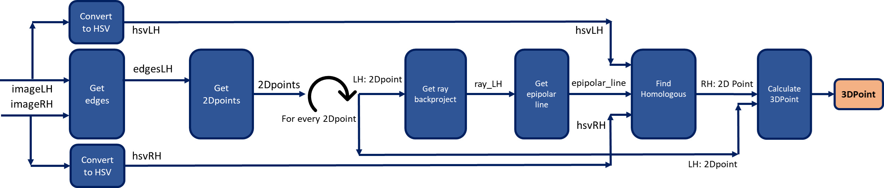
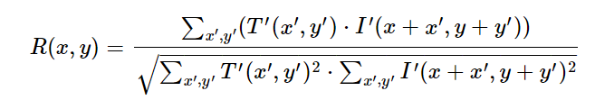
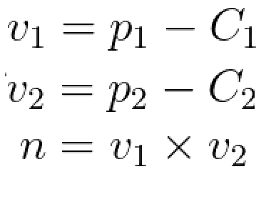
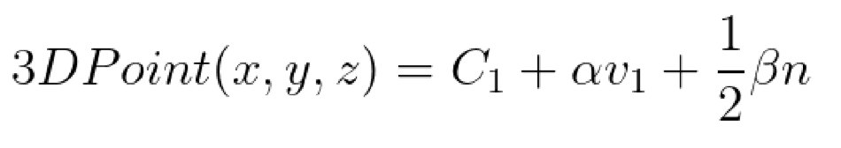
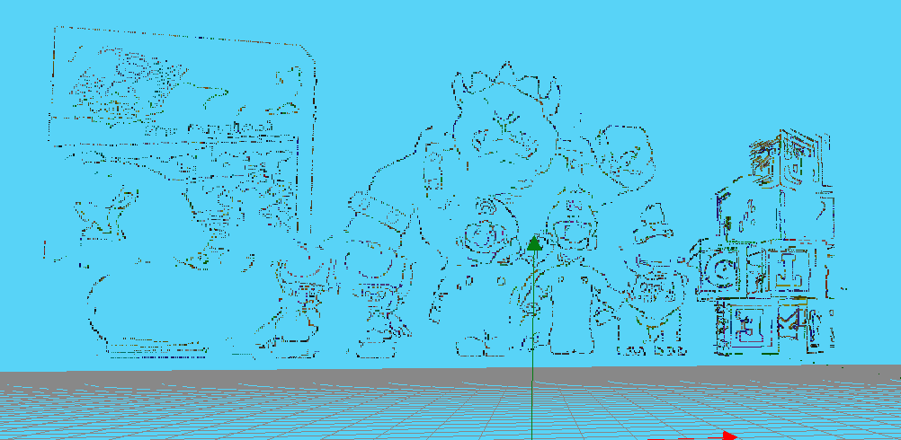

# ROBOTICS VISION 
## [Vicente Gilabert Maño](https://www.linkedin.com/in/vgilabert/)
### Master degree in Computer Vision (URJC)

---

## Exercise 2 - 3D Reconstruction


### 1. Introduction
In this work a 3D reconstruction is going to be performed using a robot (kobuki) with stereoscopic vision. 3D reconstruction is the process of determining the 3D profile of an object, as well as knowing the depth of the points of the scene.

In our case the reconstruction is going to be performed based on software.  This approach is based on the computational power of the computer to determine the 3D properties of the object using two images of the scene obtained from cameras in different positions. We will use the epipolar geometry with the properties and restrictions that it gives us, to be able to triangulate the two images at a point and obtain the depth of the point. 

Below is an image of the scene to be reconstructed with the various objects in it: 

<p align="center">
	
</p>

The following image shows the view of each camera of the robot, which is the information we have to perform the 3D reconstruction.

<p align="center">
	
</p>

We have to review some of the functions and methods provided by the JdeRobotics platform for the implementation of the solution. The following are the ones that will be used:

* Image acquisition of the indicated camera:
  ```python
  HAL.getImage('left')
  ```

* Show one image and show multiple images:
  ```python
  GUI.showImage(img)
  GUI.showImages(edgesLH, edgesRH, True)
  ```

* Change from image coordinates to camera coordinates:
  ```python
  HAL.graficToOptical('left', point2d_homogeneous)
  ```

* Change from camera coordinates to image coordinates:
  ```python
  HAL.opticalToGrafic('left', point3d_homogeneous)
  ```

* Calculate the projection of a 3d point to an image plane:
  ```python
  HAL.project('left', point3d)
  ```

* Calculates the back projection line with a 2D point (image):
  ```python
  HAL.backproject('left',point2d)
  ```

* Transform 3D Point Space after triangulation to the 3D Point Viewer:
  ```python
  HAL.project3DScene(point3d)
  ```

To have an overview of the algorithm created to solve the 3D reconstruction problem, the following scheme is attached:

<p align="center">
	
</p>

---
### 2. Preprocessing

In order to perform the 3D reconstruction, the first step would be to obtain features points to match them in the two images.
In some cases you can use features extracted using descriptors such as SIFT or ORB. 

In our case we are going to use the edges (high frequencies) of the images to get the features of both images and calculate the relationship between them. For this we will use a Canny edge filtering that leaves the filtered image with quite fine edges. Bilateral filtering is used to homogenize the image and avoid possible noise.

<p align="center">
	
</p>

> **_NOTE:_** *The function developed to obtain the above result is: get_edges(img, sigma=0.33)*

---
### 3. 2D point selection

Once we have the edge images that we have seen in the previous point, we obtain the coordinates of the pixels different than 0 value, so we return the position (Y,X) of each characteristic point.

Using the bilateral filtering that we have discussed, we manage to reduce the large number of feature points. Because each time it has been tested we get about 12000-18000 feature points to process and get the corresponding 3D point.  

To avoid processing the large amount of points, we implement the option of random selection of feature points using the variable N which applies a filtering to keep a percentage of feature points. In this step you can set the parameter N (values >0 and up to 1) which is a percentage to filter all points, where a value of 1 means that there is no filtering and all points are selected and a value of 0.5 means that **randomly** we are left with half of the points.

The result will be an array of dimensions (total_points, 2).

> **_NOTE:_** *The function developed to obtain the above result is: get_pixels_to_match(img, N=1)*

---
### 4. Calculation of epipolar.

Using the feature points obtained in the previous section, which are 2D points in image coordinates, the calculation of the epipolar line will be performed to try to find the homologous pixel in the right image.

Having a pixel in an image it is not possible to obtain a point in 3D space, but by backprojecting from the center of the camera (O1) to the pixel (p) in camera coordinates we get a line that can be useful to continue with our problem.

With the obtained line (O1, p), we can project the line on the right camera obtaining the epipolar line (e', p').

The epipolar line indicates the position where the pixel of the left image should be in the right image.  It does not indicate a point but a straight line, which makes a great restriction of the problem since we must look for the match in this line.

<p align="center">
	
</p>

> **_NOTE:_** *The function developed to obtain the above result is: get_epipolar(cam, ray, imgSize, ksize=9)*

---
### 5. Find the match.

With the epipolar line obtained in the previous section, we are going to perform a template matching of a locality of the pixel in the left image for each pixel included in the epipolar line obtained.

Using an OpenCV function for matching (cv2.matchTemplate) with the shifted mean cross-correlation setting (cv2.TM_CCOEFF_NORMED), the obtained epipolar line is run to find the best match for the left image. We use the images converted to the HSV color space for better color matching, as this space is more robust and invariant to illumination.

<p align="center">
	
</p>

To optimize the processing and not to search the whole image, a cropping of the image is performed where we only pass to the function the rows where we know that the pixel should be placed due to the epipolar restrictions.

Example:
```python
epi = 200 		#epipolar_line
k_size = 11		#kernel size
m = 2			#margin
k_half = floor(k_size/2)	#Half of kernel size.

img_crop = img[epi-k_half-m:epi+k_half+m+1, :, :]
```
The dimension obtained from this cropping would be (14, 640, 3).

We keep the 2D pixel with the highest similarity value obtained if it exceeds a threshold of 0.9. If it does not exceed this threshold, this point will not be saved.

Right now with a match higher than 0,9, we would already have the pixels in both images so we would have to find the 3D position we are looking for.

> **_NOTE:_** *The function developed to obtain the above result is: find_best_similar(point, imgLH, imgRH, epi_line, ksize=9):*

---
### 6. 3D point calculation.

Once we have a point in the left image and its counterpart in the right image, we can perform the triangulation to obtain the 3D point.

With these points and the centers of the cameras, we obtain the vectors to perform the triangulation. These 3D vectors are difficult to touch, so it is necessary to solve it by least squares to obtain the midpoint of the normal vector to both rays.

<p align="center">
	
</p>

<p align="center">
	
</p>

Equation system to solve using Least-Squares:

<p align="center">
	
</p>

Where n is the vector product of both vectors.

> Using **numpy.linalg.lstsq(A, b)** to solve the system Ax=b. Where A = [v1, n, -v2].T and b = C2 - C1.


The result of the least squares will be alpha and beta that we will use to obtain the final point in 3D.

<p align="center">
	
</p>

> **_NOTE:_** *The function developed to obtain the above result is: compute_3Dpoint(point, ray_LH)*


---
### 7. Results and conclusions.

Attached are some images with the results obtained:

* Result using kernek size 21.
<p align="center">
	
</p>

Here is a link to see a run (video speed up x2) of the reconstruction with our algorithm:

<p align="center">
	<a href="https://www.youtube.com/watch?v=lvjwnNlHUUk" target="_blank">
	
	</a>
</p>

As conclusions, we can say that by using the edges as feature points the reconstruction achieved is of the edges. The result is quite good, since we get the desired edges and with the depth that touches for the various objects.
A factor against is the computation time, which is very far from the real time, so it complicates the use in a real robot. The processing could be parallelized to try to reduce this time.

It has been good practice to experiment with 3D reconstruction of a scene with a stereo pair of cameras. By working on it, the concepts studied in the theoretical part of the 3D Vision course have been consolidated.

> **_NOTE:_** *The final python file is: 3d_reconstruction.py*