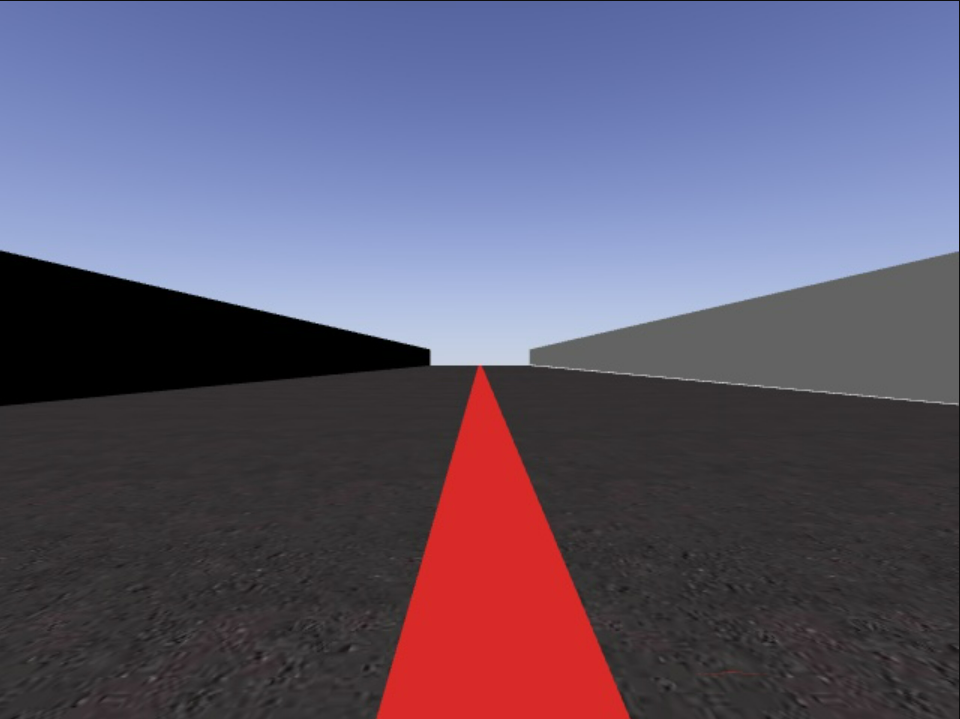
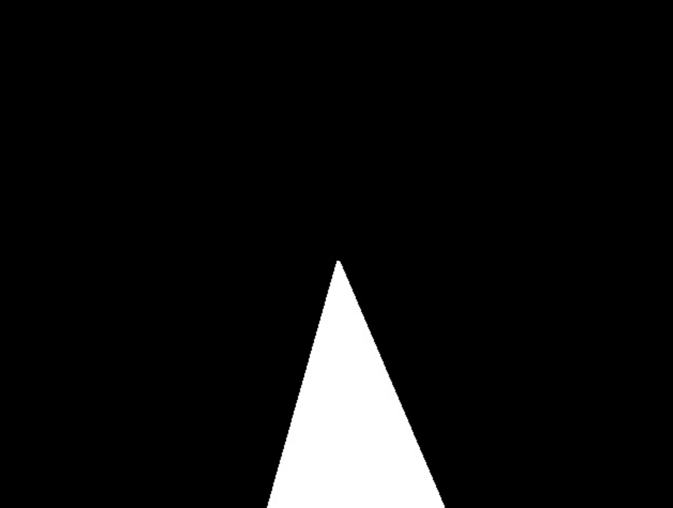
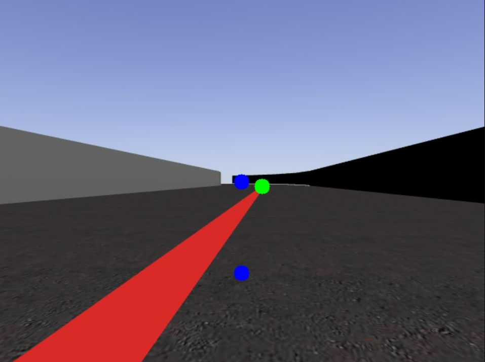

# ROBOTICS VISION 
## Vicente Gilabert Maño
### Master degree in Computer Vision (URJC)

---

## Exercise 1 - Follow red line.


### 1. Introduction

The objective of this practice is to develop a system to try to control a car over a red line on the road.

<p align="center">
  
</p> 

You have to try to go as long as possible over the red line and avoid uncontrolled rolling of the car. This can be achieved with different PID control approaches.


### 2. Controls

For this we are going to use the robotic simulation platform [Unibotics](https://unibotics.org/), which will allow us to program in Python to control the robot (car in our case).
This platform provides us with some libraries and methods to control the robot. These are explained below:

* __from HAL import HAL__ -> Hardware Abstraction Layer. Contains functions to send and receive information to the robot hardware (Gazebo).
* __from GUI import GUI__ ->  Graphical User Interface. Contiene las funciones para la visualizacion de imagenes.

* To receive the image from the robot's camera:
```python
 HAL.getImage()
```
* To assign the speed of the robot:
```python
 HAL.setV()
```
* To assign the rotation of the robot:
```python
 HAL.setW()
```
* To visualize the images in a window of the platform:
```python
 GUI.showImage()
```


### 3. Perceptual and preprocessing system

Humans are used to images and know how to interpret the scene, detecting objects or any detail. 
In robotics one of the most used sensors are cameras due to the large amount of information they contain.
Although it is not always a simple task, since we have a matrix of numbers where we have to extract the information, so in some cases it is often a difficult task.

For our problem, being a fairly controlled case, we will detect the red line with a color filtering in the HSV space. Some morphological operations will also be applied to eliminate possible noise that may appear in the image.
The result of this function for each *frame*, will be a result similar to the following:

<p align="center">
	<a href="https://www.google.es/">
	
	</a>
</p>

Once we have the mask containing the red color information, the contours of the image have been obtained. From the obtained contours have been filtered by size, to avoid possible small contours that affect us and thus robust the system. Using the contour with the largest area, we have obtained the highest point, i.e. the one with the smallest y-coordinate. 
In the following image you can see in green the highest point (lowest y):

<p align="center">
  
</p> 

The other two points in blue are the image centers, i.e. our reference points. Only the highest blue point has been used for the control.


### 4. Proportional Control (P)

Once we have finished the preprocessing, where it returns a point (the highest point of the contour) we will obtain the deviation (error), which will be:

```
error = pto_ref - pto_actual
```
Where pto_ref is the x-coordinate of the center point of the image and pto_actual is the x-coordinate of point a of the current *frame*.


The first approach to solve the problem is the proportional control, where we will simply have a variable *kp* to adjust experimentally to obtain the rotation in each *frame*.
```
giro = kp * error
HAL.setW(giro)
```

With this control we are modifying the turn of our car, depending on the error obtained in each *frame*.
In this case the **speed remains constant** during the entire lap of the circuit. The best parameters tested with the times and comments are:

| **Kp_W** | **speed** | **time** |                         **comments**                        |
|:--------:|:---------:|:--------:|:-----------------------------------------------------------:|
| 0.008    | 4         | 1.49 min | driving with a fine roll and considerable time on the line. |
| 0.008    | 5         | 1.29 min | light swing but less time on the line.                      |
| 0.01     | 5         | 1.27 min | more abrupt swing but more time on the line.                |
| 0.008    | 6         | 1.14 min | finer swing, faster time lap but not as long on the line.   |
| 0.01     | 6         | 1.14 min | more abrupt swing but more time on the line.                |

Attached is a video trying to get a balance between lap time and fine driving on the line:
Parameters: speed = 6 ; kp_W = 0.01

[](https://www.youtube.com/watch?v=OrHpqVX2hmI)

> **_NOTE:_** *Python file used in this exercise is P_CONTROL.py.*


### 5. Adding derivative control (PD)

A possible improvement to smooth the drive and avoid a swing as abrupt as the previous case, is to add one more variable. 
The D (Derivative) controller provides an output depending on the current error rate with respect to the error at the previous time. This controller is added with the P (proportional) controller.
The expected consequence of this component is that if the error continues to increase from one instant to the next, the correction applied by the proportional component will be intensified. In other words, the response will be intensified if the correction is not sufficient and damped if it approaches the optimum.

```
diff_error = error - last_error
giro = kp * error  +  kd * diff_error
```
Where *error* is the error of the current frame and *last_error* is the error of the previous frame. 
In this PD control PD we have two variables *kp* and *kd* to adjust experimentally to obtain the rotation in each *frame*.

With this control we are modifying the turn of our car, depending on the error obtained in each *frame*.
In this case the **speed remains constant** during the entire lap of the circuit. After many tests one of the best solutions found to obtain a balance between lap time and driving on the line is the following:

[](https://www.youtube.com/watch?v=AqDBD71PByo)

> **_NOTE:_** *Python file used in this exercise is PD_CONTROL.py.*


### 5. Adding Integral control (PID)

For this latest version an integral control has been added with a *ki* parameter that multiplies the summation of the current error with the previous one. This means that the error is accumulated and its effects are as follows:
- In a curve step this component (*ki*) is forcing a correction in the direction of the curve, compensating for the error that P cannot rectify.
- If we manage to correctly parameterize this component, it allows to damp the oscillations.

```
diff_error = error - last_error
sum_error = error + last_error
giro = kp * error  +  kd * diff_error + ki * sum_error
```

Where *error* is the error of the current frame and *last_error* is the error of the previous frame. 
In this PD control PD we have two variables *kp*, *kd* and *ki* to adjust experimentally to obtain the rotation in each *frame*.

With this control we are modifying the turn of our car, depending on the error obtained in each *frame*.
In this case the **speed remains constant** during the entire lap of the circuit. After many tests one of the best solutions found to obtain a balance between lap time and driving on the line is the following:

[](https://www.youtube.com/watch?v=AqDBD71PByo)

> **_NOTE:_** *Python file used in this exercise is PID_CONTROL.py.*


### 6. Speed Control

To further refine the velocity, we use a case-based controller, depending on whether we are on a straight line, a small curve, a medium curve, a large curve or a steep curve. To estimate what the curve looks like, we rely on the dispersion (error) between the center point and the top point and the displacement error made.   

```
error = pto_ref - pto_actual
```
Where pto_ref is the x-coordinate of the center point of the image and pto_actual is the x-coordinate of point a of the current *frame*.

The speed will be variable within two ranges, speed_max and speed_min. The function to adjust the speed in the curves is as follows:

```python
def adjust_vel(error, vel):
    error = abs(error)
    
    if error > min_th and error < min_th+20:
        new_speed = vel - vel*0.001
    elif error >= min_th+20 and error < min_th+40:
        new_speed = vel - vel*0.003
    elif error >= min_th+40 and error < min_th+60:
        new_speed = vel - vel*0.006
    elif error >= min_th+60:
        new_speed = vel - vel*0.009
    
    if new_speed < speed_min:
        new_speed = speed_min
    
    return new_speed
``` 
Where *min_th* is a threshold (20 px) selected by user to consider what is a straight line. In this case, *vel* is the actual speed of the car. If the error speed is higher than the maximum speed, we assign new_speed = max_speed.

Different tests have been carried out, where the time results have been improved but not in a remarkable way. A sample video is attached:


> **_NOTE:_** *Python file used in this exercise is PID_CONTROL_SPEED_CASE.py.*


### 7. Conclusions

After the work done and quite a few tests with different parameters and possible configurations, the main conclusions are:A P, PD and PID control system has been implemented. With the PD control system the timing and control is improved, but with PID no improvement can be seen.

* Using kp of the P controller, we can correct the error. If it is too high, it has a very sharp movement, but if it is too low, because it is so light, it cannot rotate and it crashes.
* Using kd of the PD controller, it tries to correct the possible error of the P controller, but if it is too high it can affect the oscillation by increasing the oscillation with a greater abruptness.
* With the ki of the PID controller, I have not seen a noticeable improvement. I don't know if it is a parameter problem or if it is just a comparison with the previous frame that has no effect.

As a general conclusion it is necessary to look for a balance between the speed of the car and that the car goes as much as possible along the line. In my case I have tried to make the car go a little faster, even if it spends less time on the line. As the speed increases, the processor speed must be higher, so the code must be able to run in real time.
