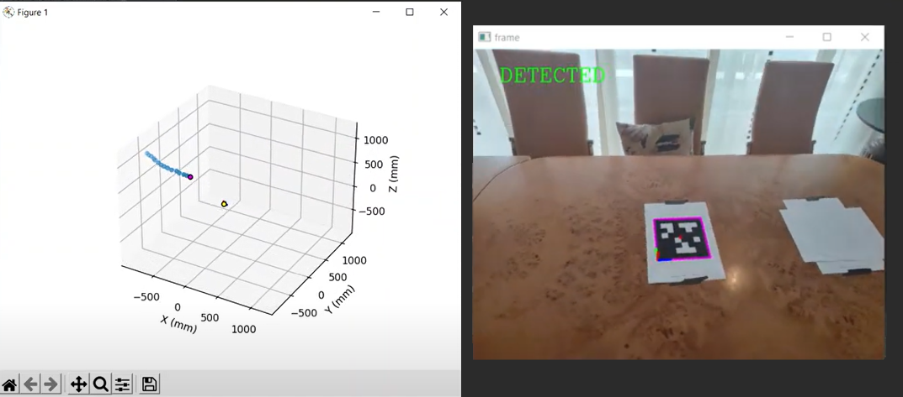

# ROBOTICS VISION 
## [Vicente Gilabert Maño](https://www.linkedin.com/in/vgilabert/)
### Master degree in Computer Vision (URJC)

---

## Exercise 3 - Tag Detection and 3D representation of the camera position.


### 1. Introduction

The purpose of the following work is to obtain a three-dimensional representation in real time of the position of the camera in a scene by detecting beacons for self-localization.

We are going to use the Webcam IP application, where we will obtain the frames from our mobile phone. The resolution of the images obtained is (960,1280) with a frame rate of 10fps.
In these images we will perform the tag detection and the calculation of the 3D position of the camera using the rotation matrix (R) and the translation vector (tvec).
To obtain the R and tvec, the solvePnP function is used, with the known 3D positions of the tag and corner pixels of 2D chessborad image.
The corner pixels of the beacons are obtained using the apriltags library, which gives us the four points (x,y) corresponding to the corners.

All the previous process is depending on the calibration of the camera. We must obtain a correct calibration to obtain the intrinsic matrix and the possible distortion of the lens.

---
### 2. How to use?

To run the program, the files and possible configurations are described below:


* A python repository with bindings to the apriltags (C) library has been used. It only works with Python 3.6 and 3.7. We install all the necessary libraries that are included in the requirements file.
  ```
  python -m pip install --upgrade pip
  pip install -r requirements.txt
  ```


* To perform the camera calibration, the script **camera_calibration.py** has been implemented:
  ```
  python camera_calibration.py --folder images_Calibration/ --chess_shape (9,6) --chess_size 24
  ```

  The script parameters are as follows: 
  
  |  -  |       --        | Description                                                                     |
  |:---:|:---------------:|:-------------------------------------------------------------------------------:|
  | -f  | --folder        | Path to folder with images to calibrate camera.                                 |
  | -sh | --chess_shape   | Shape. Number of rows and columns to detect in chessboard.  Default=(9,6)       |
  | -sz | --chess_size    | Size of every rectangle of chessboards (mm).  Default=24                        |
  | -sv | --path_save     | Path to save calibration parameters in file .npy.  Default=results_calibration/ |
  | -p  | --plot_cameras  | Activate flag to 3D plot of all cameras positions.                              |


* To run the main application for tag detection and position calculation is **get_position.py**:
  ```
  python .\get_position.py -c results_calibration/parameters_20220514_123408.npy -id http://192.168.100.74:4747/video -s -p
  ```
  
  The script parameters are as follows: 
  
  |  -  |       --        |                                                 Description                                                 |
  |:---:|:---------------:|:-----------------------------------------------------------------------------------------------------------:|
  | -c  | --camera_params |                           Path to file with camera calibration parameters (NPY).                            |
  | -s  | --showResult    |                    If flag is sent, the display of detection is activated. Default=False                    |
  | -p  | --plot3D        |          If flag is sent, the display of 3D space with camera position is activated. Default=False          |
  | -id | --camera_id     | Camera id (0, 1, ..., N) or url to IP camera (http://192.168.100.74:4747/video) or path to video. Default=0 |
  


---
### 4. Camera calibration

For the objective of this work it is necessary to perform a calibration of the camera to obtain the intrinsic parameters (K) of the camera.

> python camera_calibration.py --folder images_Calibration/ --chess_shape (9,6) --chess_size 24

A chess image with a size (9,6) corners and a square size of 24mm has been used. The total number of images used for the calibration is 48. Below you can see some of these images:

<p align="center">
	
</p>

With the script explained in the previous point, our calibration has been performed. The implemented process has been:

1. Load the images for calibration.
2. For each image perform a corner detection. ```cv2.findChessboardCorners```.
3. Refine the obtained result to increase the accuracy. ```cv2.cornerSubPix```.
4. Define the 3D points of each corner of the chessboard pattern. ```get_chessboard_points((9,6), 24, 24)```.
5. With the defined 3D points and the 2D points found in each image, perform the camera calibration. ```cv2.calibrateCamera```.
6. Save calibration results to an .npy file and display the result.

The following shows the camera position for each image we have used in the calibration:

<p align="center">
	
</p>


---
### 5. Tag detector and get camera position.

Once we have the camera calibrated, we can start with the detection of the tags and the calculation of the camera position. 

The steps are as follows:
1. Load intrinsic parameters of the camera (K and distortion).
2. Connect to the mobile camera via the web address. 
3. Convert the image to grayscale.
4. Apply the tag detector ```Detection = at_detector.detect(gray, estimate_tag_pose=False)```.
5. For each Detection obtained (can detect more than one tag in the image) by solvePnP get rvec and tvec. ```cv2.solvePnPRansac```.
6. A refinement of rvec and tvec is performed by an iterative optimization process using Levenberg-Marquardt. ```cv2.solvePnPRefineLM```.
6. We use ```cv2.Rodrigues``` to convert rvec to R (matrix). With the following formula we obtain the optical center of the camera in world coordinates:
<p align="center">
	
</p>
7. The 3D representation is performed. For the 2D representation painted beacon and axes calculated by a projection from 3D to 2D space. ```cv2.projectPoints```.

The result that can be observed when running the application is the following:
<p align="center">
	
</p>

---
### 6. Results

The configuration of the tag used has been:

<p align="center">
	
</p>
>  All measurements above are in millimeters.


Three demonstration videos have been made showing examples for 1, 2 and 3 tags in the detection:

* One tag:
	<p align="center">
		<a href="https://www.youtube.com/watch?v=ACiy273RN0g" target="_blank">
		
		</a>
	</p>

* Two tags:
	<p align="center">
		<a href="https://www.youtube.com/watch?v=XjnPv5EeaSE" target="_blank">
		
		</a>
	</p>

* Three tags:
	<p align="center">
		<a href="https://www.youtube.com/watch?v=Z6aoJRJHjtY" target="_blank">
		
		</a>
	</p>

---
### 7. Conclusions.

* A script has been implemented to perform the calibration of a camera using N images. 

* A script has been implemented to use a mobile camera and to be able to autolocalize it by detecting tags and solving the PnP problem to find rvec and tvec.

* A real time implementation has been achieved, where we can visualize the results in 3D and 2D.

* I really liked to do this practice because it has been used what I have learned in the subject of Three Dimensional Vision and Robotic Vision.